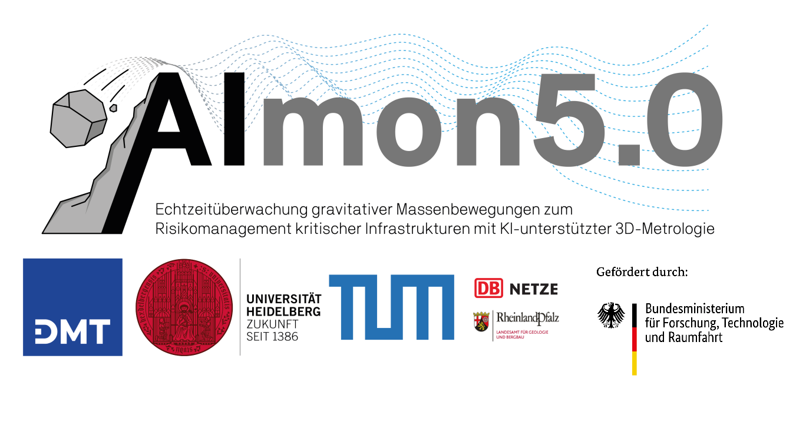

# Welcome to AImon<sup>5.0</sup>


[](https://opensource.org/licenses/MIT)

## Overview of the research project
### Project title
Integrated, quality-assured real-time assistance system for risk management of infrastructures and natural hazards using autonomous 4D detection, 3D-metrology and artificial intelligence.

### Project idea
Our environment and the earth's surface are subject to constant change, with the speed and extent of change accelerating in recent years. Global warming and the resulting climate change are changing the framework conditions. As a result, geohazards caused by natural events, but also as a consequence of anthropogenic interventions, are increasing. For example, intensive, prolonged precipitation is causing more frequent landslides or rockfalls. Such events pose a particular threat to the local population, who have a special interest in preventing these events. In addition, central and critical infrastructures (e.g. railroad lines or road traffic routes) are particularly potentially affected by such natural hazards, which can have far-reaching economic consequences.

A central instrument in integrated risk management for well-founded decision support is the availability of relevant 4D geoinformation (i.e. highly accurate 3D data with high temporal resolution) captured by permanent monitoring or on-demand queries in near real time. The current state of research provides so-called permanently installed and autonomously operating laser scanning (PLS) systems at , which have already demonstrated their enormous potential for monitoring local hazard areas in prototype studies. PLS systems deliver huge volumes of data (billions of measurements per day), for which the first computer-based analysis methods already exist. In order to make PLS systems and 4D methods available for operational applications and to limit the flood of data to the relevant information at , a new interface is needed between the information requirements of the application and 4D recording and evaluation.

The specific needs and the application knowledge of the stakeholders are to be linked in this new system with the autonomous PLS- system and the PLS data archive using AI methods and 4D data analysis. This should make it possible for the first time to use state-of-the-art PCS systems in operational risk monitoring and to find relevant events in the huge amounts of data (e.g. activation of a slope area) and to track them in continuous monitoring at and automatically identify new events. This research project thus makes it possible for the first time to use PLS systems in continuous monitoring and to enable stakeholders to use them in risk monitoring.

The aim of the joint research project is to further close the gap between research and application. Different methods for multi-temporal analysis and special sub-topics (e.g. uncertainty of change analysis / “level of detection”) have largely been developed and evaluated. Therefore, a high degree of application orientation should form the basis of this application and existing methods should be further developed and supplemented accordingly. 


<!-- AImon<sup>5.0</sup> is a comprehensive tool designed for processing and projecting point cloud datasets. It facilitates the generation of range and color images, applies changes based on predefined events, and performs bi-temporal analysis to detect and visualize changes in spatial data. -->

## 🔨 Methods provided by AImon<sup>5.0</sup>
The following methods.... were provided by the 3DGEO lab (add link)


TODO: Work packages as "research target/aim/goals"
- **WP X.0**
- **WP X.1**
- ...

### Possible applications:
- **Point Cloud Projection**: Generate range and color images from point cloud data.
- **Bi-Temporal Analysis**: Compare point clouds from different time frames to detect changes.
- **Change Event Management**: Convert clusters into change events.
- **Data Handling**: Efficiently split, append, and merge LAS/LAZ files.
- **Visualization**: Projected images and change events visualization.

## 🎮 Examples
|                                                                                                                                                                                                                   |                                                                                                                                                                                                                         |
|-------------------------------------------------------------------------------------------------------------------------------------------------------------------------------------------------------------------|-------------------------------------------------------------------------------------------------------------------------------------------------------------------------------------------------------------------------|
| Example 1: Rule based classification of change events <br> <a href="demo/classification_of_change_events_rule_based.ipynb"></a>                                | Example 2: Rule based filtering of change events <br><br> <a href="demo/filtering_of_change_events_rule_based.ipynb"></a>                                              |
| Example 3: Manually labelled dataset for random forest training <br> <a href="demo/classification_of_change_events_using_random_forest_classifier.ipynb"></a> | Example 4: Random forest classification on prediction dataset <br> <a href="demo/classification_of_change_events_using_random_forest_classifier.ipynb"></a> |
<!--
| Example 5: Unsupervised classification of change events <br> <a href="demo/classification_of_change_events_unsupervised.ipynb"></a>                                       |
-->

## 💻 Installation with a Conda environment

To avoid negative interactions between installed packages and version conflicts, a conda environment should be created for each new project. Follow the three next steps:

1. Create a new environment and activate it.
```bash
conda create --name aimon python=3.11 -y
conda activate aimon

```

2. Clone this repository and navigate to the main folder **aimon**
```bash
git clone https://github.com/3dgeo-heidelberg/aimon.git
cd aimon
```

3. Install the release version using pip
    1. Regular installation

    ```bash
    python -m pip install .
    ```

    2. Editable mode

    ```bash
    python -m pip install -v --editable .
    ```


# Key Functions
## Using main.py file
Serves as the entry point for the AImon<sup>5.0</sup> processing workflow. It orchestrates the execution of various processing stages, including configuration setup, bi-temporal analysis, and change detection.

Usage from the main repository folder:
```bash
python cd src/aimon/main.py -c "<path/to/config_file.json>" -f "<path/to/t1_point_cloud.las>" "<path/to/t2_point_cloud.las>"
```

## 🐍 Documentation of software usage
As a starting point, please have a look to the [Jupyter Notebooks](demo) available in the repository 


## 📑 Citation
Please cite AImon<sup>5.0</sup> when using it in your research and reference the appropriate release version.

<!-- TODO: All releases of py4dgeo are listed on Zenodo where you will find the citation information including DOI. -->

```
article{AImon5.0,
author = {AImon5.0 Development Core Team}
title = {AImon5.0: tool for 3D point cloud processing and projection},
journal = {},
year = {2025},
number = {},
volume = {},
doi = {},
url = {https://github.com/3dgeo-heidelberg/AImon},
}
 ```

## 💟 Funding / Acknowledgements
TODO: Add funding and acknoledgment

I just add some text here to test stuff
## 🔔 Contact / Bugs / Feature Requests
You think you have found a bug or have specific request for a new feature? Please open a new issue in the online code repository on Github. Also for general questions please use the issue system.

Scientific requests can be directed to the [3DGeo Research Group Heidelberg](https://uni-heidelberg.de/3dgeo) and its respective members.

## 📜 License
See [LICENSE.md](LICENSE.md).


## 📚 Literature
* Paper 1
* Paper 2
* ...
