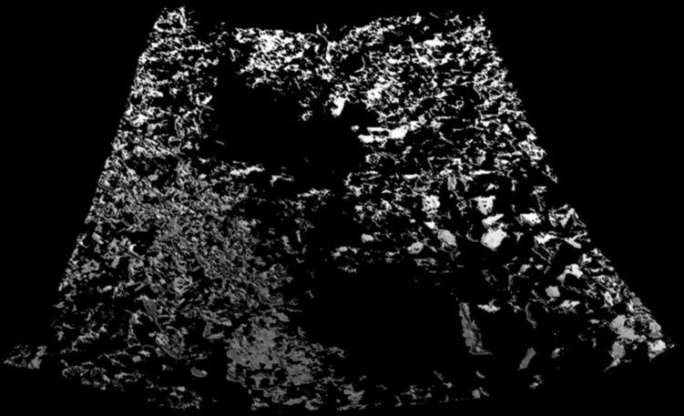

<br>

# Welcome to AImon5.0
<a href="https://www.geog.uni-heidelberg.de/en/institute/geoinformatics/3dgeo-research-group/projects-of-the-3dgeo-research-group/aimon50">

[](https://opensource.org/licenses/MIT)

## 📑 Research project definition
Real-time monitoring of gravitational mass movements for critical infrastructure risk management with AI-assisted 3D metrology

<!-- ### 🎯 Overall objective of the project -->
### - Overall objective
<div style="text-align: justify">
Our environment and the Earth's surface are constantly changing, and global warming and climate change are accelerating the pace and magnitude of these changes. As a result, geohazards - triggered by natural events or human activities - are becoming more frequent. For example, intense and prolonged rainfall is increasingly causing landslides and rockfalls that threaten local populations and critical infrastructure such as railways and roads, with serious economic consequences.

A key tool for integrated risk management is access to relevant 4D geospatial information - accurate 3D data with high temporal resolution - acquired through near real-time, permanent or on-demand monitoring. Permanently installed autonomous laser scanning (PLS) systems have shown great potential for monitoring hazard zones, producing billions of measurements daily. Early computational methods exist to analyze this data, but to make it operational, a new interface is needed to bridge application needs with 4D data collection and analysis.

This interface will connect stakeholder expertise with autonomous PLS systems and data archives using AI and 4D analysis. It will enable the operational use of PLS for risk monitoring - detecting and tracking relevant events such as slope activity in real time. For the first time, stakeholders will be able to use PLS for continuous hazard monitoring.
</div>

<!-- ### 📌 Study site -->
### - Study site
<div style="text-align: justify">
The goal of this project is to bridge the gap between research and practice. While key methods for multi-temporal analysis and subtopics such as uncertainty in change detection have been developed, this project focuses on refining and extending them for practical, application-oriented use. The 
<a href="https://www.geog.uni-heidelberg.de/en/3dgeo">3DGeo Research Group Heidelberg</a> developed computer-based methods for automatic information extraction and visualization from 4D-PLS data. The study site is located in 
<a href="https://maps.app.goo.gl/1k6VpK1gXzoZ1TLJ9">Trier Germany</a> (Fig. 1), at the 
<a href="https://maps.app.goo.gl/JLSZRwxY1ppR6zbr7">Trierer Augenscheiner</a> (Fig. 2).
</div>


|                                                                                                                                                                                                                   |
|-------------------------------------------------------------------------------------------------------------------------------------------------------------------------------------------------------------------|
| <br/> Study site of the AImon5.0 project located in Trier in Germany (red dot). |


<!-- ### 🧭 Approach Development -->
### - Approach Development
<div style="text-align: justify">
The methods are particularly suitable for operational use and adapted in order to deliver reliable and timely results. Automated information extraction represents a central interface between the PLS system in the field, the quality-assured change information, and the end users. Scientifically, we investigate and combine two complementary concepts that can integrate expert knowledge into automated data analysis: 

1. <u>Top-down approach via a knowledge- and rule-based classification of changes</u>: In that case, the users know exactly which events they want to find in the data streams and how these processes (e.g. rockfall) are defined in their sequence. A methodology and data management for fast and accurate searches must be developed and evaluated;

2. <u>Data-driven approach using AI</u>: Machine learning methods find relevant change events after a user-controlled training phase and present them to the experts for evaluation. The users do not know in advance how the events, possibly also overlaid processes, are represented in the data, but can evaluate relevant from non-relevant events and thus train an AI model.

For this second approach, research must be carried out into how the state-of-the-art point cloud-based deep learning models can be trained quickly and as automatically as possible in the background and how the hyperparameters can be optimized. For the visualization of the detected and classified changes, it must be determined - in coordination with end users and the PLS operator - which abstraction levels and visualization forms are best suited for certain tasks and also specified reaction times. In contrast to visualization in 2D and 3D (e.g. in GIS or dashboards), fundamental research must be carried out for the visualization of 4D processes in PLS data due to a lack of existing methods.
</div>


## ⚙️ Work packages
<div style="text-align: justify">
The following methods were developed by the 
<a href="https://www.geog.uni-heidelberg.de/en/3dgeo">3DGEO research group</a>.

 <br>
A change event is characterized by different attributes, each representing a measurable dimension of the change. The diagram of Fig. 3 highlights the modular structure of change events, emphasizing how temporal and spatial metrics combine to define and categorize observed changes. A classifier assigns an event type to the change based on the characteristics, enabling semantic interpretation of what kind of event occurred (e.g., gravitational mass movement, change in vegetation, etc).


- **Research target 1 - Hierarchical classification of detected change:**  Developing new methods and tools to automatically extract relevant change information from the two last point clouds. We analyse different types of changes in the terrain (e.g. rockfall events, movements or erosion processes) fully automatically by delimiting them in terms of time and space. Five different steps:
    - 1.1: Rule based change classification
    - 1.2: Hierarchical analysis
    - 1.3: ML/DL change classification
    - 1.4: Derivation of adaptive workflows
    - 1.5: Continuous integration in 
<a href="https://github.com/3dgeo-heidelberg/py4dgeo/tree/main">py4dgeo</a>

- **Research target 2: Visualization of classified change events**: Development of new methodologies and tools for the visualization of the detected terrain changes from WP 5 and WP 6 for use by end users. Three different steps:
    - 2.1: Selection of relevant changes
    - 2.2: 2D GIS layer
    - 2.3: 3D objects

### - Possible applications
- **Point Cloud Projection**: Generate range and color images from point cloud data.
- **Bi-Temporal Analysis**: Compare point clouds from different time frames to detect changes.
- **Change Event Management**: Convert clusters into change events.
- **Data Handling**: Efficiently split, append, and merge LAS/LAZ files.
- **Visualization**: Projected images and change events visualization.
</div>

## 🎮 Examples
|                                                                                                                                                                                                                   |                                                                                                                                                                                                                         |
|-------------------------------------------------------------------------------------------------------------------------------------------------------------------------------------------------------------------|-------------------------------------------------------------------------------------------------------------------------------------------------------------------------------------------------------------------------|
| Example 1: Rule-based classification of change events <br> <a href="classification_of_change_events_rule_based.html"></a>                                | Example 2: Rule based filtering of change events <br> <a href="filtering_of_change_events_rule_based.html"></a>                                              |
| Example 3: Manually labelled dataset for random forest training <br> <a href="classification_of_change_events_using_random_forest_classifier.html"> </a> | Example 4: Random forest classification on prediction dataset <br> <a href="classification_of_change_events_using_random_forest_classifier.html"></a> |
<!-- | TODO Example 5: Point cloud projection to range image <br> <a></a>                                       | TODO Example 6: 2D GIS layers representation <br> <br> <a></a>                                       |
| TODO Example 7: 3D objects extraction  <br> <a></a>                                       | -->


## 🛠️ Key Functions
<div style="text-align: justify">
<!-- ### Using main.py file -->
Serves as the entry point for the AImon5.0 processing workflow. It orchestrates the execution of various processing stages, including configuration setup, bi-temporal analysis, and change detection.
</div>

Usage from the main repository folder:
```bash
python cd src/aimon/main.py -c "<path/to/config_file.json>" -f "<path/to/t1_point_cloud.las>" "<path/to/t2_point_cloud.las>"
```


## 📂 References & Credits
<!-- <h3> 🐍 Documentation of software usage </h3> -->
### - Documentation of software usage
As a starting point, please have a look to the Jupyter Notebooks available listed in the top left corner of the page.


<!-- <h3> 📑 Citation </h3> -->
### - Citation
Please cite AImon5.0 when using it in your research.

```
software{AImon5.0,
author = {AImon5.0 Development Core Team}
title = {AImon5.0: tool for 3D point cloud processing and projection},
journal = {},
year = {2025},
number = {},
volume = {},
doi = {},
url = {https://github.com/3dgeo-heidelberg/AImon},
}
```

<!-- <h3> 📚 Literature </h3> -->
### - Literature
TODO: Add papers here

* Paper 1
* Paper 2
* ...

<!-- <h3> 💟 Funding / Acknowledgements </h3> -->
### - Funding / Acknowledgements
TODO: Add funding and acknowledgment

<!-- <h3> 🔔 Contact / Bugs / Feature Requests </h3> -->
### - Contact / Bugs / Feature Requests
<div style="text-align: justify">
You think you have found a bug or have specific request for a new feature? Please open a new issue in the online code repository on Github. Also for general questions please use the issue system.

Scientific requests can be directed to the 
<a href="https://www.geog.uni-heidelberg.de/en/3dgeo">3DGeo Research Group Heidelberg</a> and its respective members.
</div>


<!-- <h3> 📜 License </h3> -->
### - License

This is licensed under the [MIT license](LICENSE.md).


